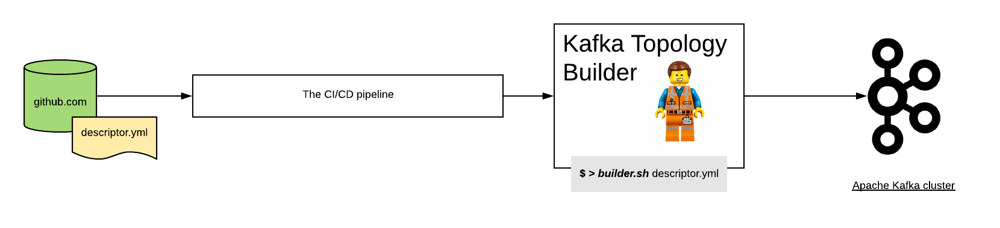

# The Kafka Topology builder tool

<a href="https://codeclimate.com/github/purbon/kafka-topology-builder/maintainability"></a> [](https://travis-ci.org/purbon/kafka-topology-builder)

[](https://gitter.im/kafka-topology-builder/community?utm_source=badge&utm_medium=badge&utm_campaign=pr-badge) [](https://kafka-topology-builder.readthedocs.io/?badge=latest)

This tool helps you build proper ACLs for Apache Kafka. The Kafka ACL builder tool knows what do you
need for each of the products/projects you are planning, either Kafka Connect, Kafka Streams or others.

## The motivation 

One of the typical questions while building an Apache Kafka infrastructure is how to handle topics, 
configurations and the required permissions to use them (Access Control List).
The Kafka Topology Builder, in close collaboration with GIT and Jenkins (CI/CD) is here to help you setup an organised and automated way of managing your Kafka Cluster.

## Where's the docs?

We recommend taking time to [read the docs](https://kafka-topology-builder.readthedocs.io/).
There's quite a bit of detailed information about gitops, Apache Kafka and how this project can help you automate your basic operations tasks.

## Automating the Topic Management with CI/CD (Jenkins) and gitops



You might be wondering what is the usual workflow to implement this approach:

**Action**: As a user, part of a developer team (for example), i like to have some changes in Apache Kafka.

**Change Request**: As a user:

- Go to the git repository where the topology is described
- Create a new branch
- Perform the changes need
- Make a pull request targeting master branch

**Approval process**: As an ops admin, I can:

- Review the pull request (change request) initiated by teams
- Request changes when need
- Merge the requests.

Considerations:

* Using webhooks, the git server (github, gitlab or bitbucket) will inform the CI/CD system changes had happened and they need to be applied to the cluster.
* All changes (git push) to master branch are disabled directly. 
Changes only can happen with a pull request.

## Help??

If you are using the Kafka Topology Builder, or plan to use it in your project? might be you have encounter a bug? or a challenge?
need a certain future? feel free to reach out into our [gitter community](https://gitter.im/kafka-topology-builder/community).

[](https://gitter.im/kafka-topology-builder/community?utm_source=badge&utm_medium=badge&utm_campaign=pr-badge)


## Feature list, not only bugs ;-)

What can you achieve with this tool:

* Support for multiple access control mechanisms:
    * Traditional ACLs
    * Role Bases Access Control as provided by Confluent
* Automatically set access control rules for:
    * Kafka Consumers
    * Kafka Producers
    * Kafka Connect 
    * Kafka Streams applications ( microservices )
    * Schema Registry instances
* Manage topic naming with a topic name convention
    * Including the definition of *projects*, *teams*, *datatypes* and for sure the topic name
    * Some of the topics are flexible defined by user requirements
* Allow for creation, delete and update of:
    * topics, following the topic naming convention
    * Topic configuration, variables like retention, segment size, etc
    * Acls, or RBAC rules

More details and examples of the functionality can be found in the wiki.  

### How can I run the topology builder direclty?

This tool is available in multiple formats:

- As an RPM package
- Directly as a fat jar (zip/tar.gz)

The latest version are available from the [releases](https://github.com/purbon/kafka-topology-builder/releases) page.

The release is as well available in [docker hub](https://hub.docker.com/r/purbon/kafka-topology-builder).

#### How to execute the tool

This is how you can run the tool directly as a docker image:

```bash 
docker run purbon/kafka-topology-builder:latest kafka-topology-builder.sh  --help
Parsing failed cause of Missing required options: topology, brokers, clientConfig
usage: cli
    --allowDelete          Permits delete operations for topics and
                           configs.
    --brokers <arg>        The Apache Kafka server(s) to connect to.
    --clientConfig <arg>   The AdminClient configuration file.
    --help                 Prints usage information.
    --quite                Print minimum status update
    --topology <arg>       Topology config file.
```

If you install the tool as rpm, you will have available in your $PATH the _kafka-topology-builder.sh_.
You can run this script with the same options observed earlier.  

#### An example topology

An example topology should look like this (in yaml format):

```yaml
team: "team"
source: "source"
projects:
- name: "foo"
  zookeepers: []
  consumers:
  - principal: "User:app0"
  - principal: "User:app1"
  producers: []
  streams:
  - principal: "User:App0"
    topics:
      read:
      - "topicA"
      - "topicB"
      write:
      - "topicC"
      - "topicD"
  connectors:
  - principal: "User:Connect1"
    topics:
      read:
      - "topicA"
      - "topicB"
  - principal: "User:Connect2"
    topics:
      write:
      - "topicC"
      - "topicD"
  topics:
  - name: "foo" # topicName: team.source.foo.foo
    config:
      replication.factor: "2"
      num.partitions: "3"
  - name: "bar" # topicName: team.source.foo.bar
    config:
      replication.factor: "2"
      num.partitions: "3"
- name: "bar"
  zookeepers: []
  consumers: []
  producers: []
  streams: []
  connectors: []
  topics:
  - name: "bar" # topicName: team.source.bar.bar
    config:
      replication.factor: "2"
      num.partitions: "3"
```

more eamples can be found at the [example/](example/) directory.