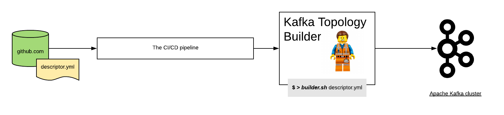

.. Kafka Topology Builder documentation master file, created by
   sphinx-quickstart on Sun May 31 09:05:19 2020.
   You can adapt this file completely to your liking, but it should at least
   contain the root `toctree` directive.

Welcome to Kafka Topology Builder's documentation!
==================================================

Welcome to the Kafka Topology Builder documentation, in this site we recollected notes and guides to provide the beginners, but as well reference for the most experienced on implementing a gitops
approach for operations in Apache Kafka.

Getting started
-------------------------------

If you have landed in this page is because you aim to get started with the Kafka Topology Builder.
To get you started we recommend:

* Want a quickstart ? checkout our demo in https://github.com/purbon/kafka-topology-builder-demo.
* New to gitops and kafka, check the :doc:`core-concepts` page.
* If you are ready to jump in, start with the :doc:`workflow-setup`.

Installation
-----------

To install the Kafka Topology Builder and enable your teams to use a gitops approach when managing Apache Kafka you need:

* A CI/CD server, for example Jenkins, but any other will serve the purpose
* A git repository where the Topology description will be stored
* And for sure a Kafka cluster :-)

See the  :doc:`workflow-setup` section to learn more how to setup the required components to enable the full workflow.

if you already have this components, you can install the topology builder agent:

* As an RPM package for RedHat/CentOS linux distributions.
* As a DEB package for Debian based OS.
* As tar.gz source package.
* As well in the form of a docker image, available from `docker hub <https://hub.docker.com/repository/docker/purbon/kafka-topology-builder>`_.

You always can self build this package, all information is available from `here <https://github.com/kafka-ops/kafka-topology-builder/blob/master/RELEASE.md>`_.
Users can download the latest "official" release artifacts directly from the download page `here <https://github.com/kafka-ops/kafka-topology-builder/releases>`_.

Help?
------------------------------

If case you require any help regarding the usage or development of the Kafka Topology Builder, don't hesitate to contact our `gitter community  <https://gitter.im/kafka-topology-builder/community#>`_.
In the future, when there is the request we might as well create a mailing list or other method of communication that help people using this project.

Contents
------------------------------

.. toctree::
   :maxdepth: 2

   core-concepts
   what-can-you-do
   the-descriptor-files
   how-to-run-it
   handling-delete-in-ktb
   workflow-setup
   powered-with
   config-values

