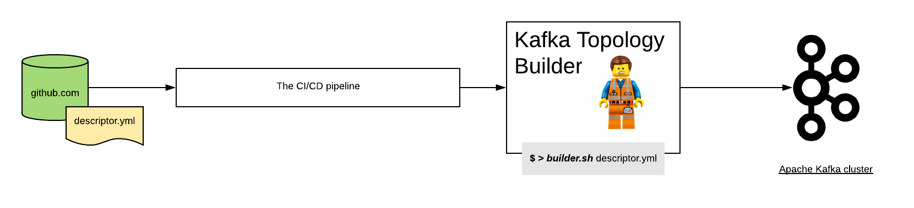
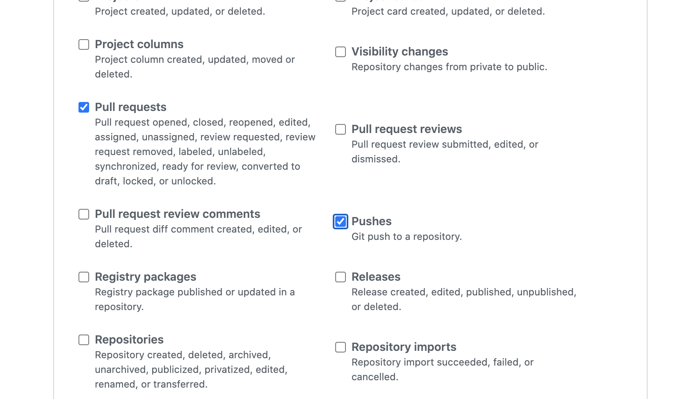

How to setup a full workflow (by example)
*******************************

This section describe the configuration steps need to setup a flow with the Kafka Topology Builder.
For this example we're going to use:

* Github as the git server.
* Jenkins as the CI/CD pipeline.

Configuration is possible with other technologies such as Gitlab or Concourse for example.

Configure the git server
-----------

From the git server perspective you are going to need to setup the next steps:

* Block the master branch to push commits, so everyone is required to perform changes using a pull request.
* Configure a webhook to inform the CI/CD pipeline every time:
  * A pull request is created or changed.
  * A merge happened to the master branch.

For Github the webhook events to be selected are:

- *Pull requests*: _Pull request opened, closed, reopened, edited, assigned, unassigned, review requested, review request removed, labeled, unlabeled, synchronized, ready for review, converted to draft, locked, or unlocked._
- push event.

it should look like this:

Setup CI/CD
-----------

As mentioned earlier the specific setup for the CI/CD pipeline will vary. In this documentation we will enumerate a few of the steps necessary if you are using Jenkins.

How many pipelines/jobs do we need?
===========

The first question is how many pipelines do you need? we recommend having two:

- The first dedicated to do change request (pull request) verifications
- A second one where we apply teh changes after merged

Setting up the PR verification pipeline
===========

The pipeline responsible of running the test for each change request should look like this:

.. code-block:: json
    :linenos:

     pipeline {

        agent {
         docker { image 'purbon/kafka-topology-builder:latest' }
        }

        stages {
            stage('verify-replication-factor') {
                steps {
                    sh 'checks/verify-replication-factor.sh ${TopologyFiles} 3'
                }
            }
            stage('verify-num-of-partitions') {
                 steps {
                    sh 'checks/verify-num-of-partitions.sh ${TopologyFiles} 12'
                }
            }
        }
     post {
        success {
            withCredentials([string(credentialsId: 'my-github', variable: 'GITHUB_TOKEN')]) {
                sh './post-hook-success.sh'
            }
        }
        failure {
            withCredentials([string(credentialsId: 'my-github', variable: 'GITHUB_TOKEN')]) {
                sh './post-hook-failure.sh'
            }
        }
     }
    }

In the previous pipeline definition, using the Jenkins Pipeline DSL, we can notice a few relevant steps:

- Is using docker as an agent. We suggest this as a best practise, but it is possible as well to run this with any agent available that has access to a host where the Kafka Topology Builder is installed.
- There are a few verification, or test, steps. This are checks that run automatically for every Pull Request.
- In the pipeline the reader can see the topology files are passes as jenkins parameters, see *${TopologyFiles}*
- An important post step is configured where the pipeline will inform back to the git server the result of the verification. This step needs access to each server token, for the case of this pipeline a previously configured github token.

Setting up the main pipeline
===========

The main pipeline should look like this:

.. code-block:: json
    :linenos:

    pipeline {

        agent {
            docker { image 'purbon/kafka-topology-builder:latest' }
        }

        stage('run') {
          steps {
              withCredentials([usernamePassword(credentialsId: 'confluent-cloud	',
               usernameVariable: 'CLUSTER_API_KEY', passwordVariable: 'CLUSTER_API_SECRET')]) {
                sh './demo/build-connection-file.sh > topology-builder.properties'
              }
              sh 'kafka-topology-builder.sh  --brokers ${Brokers}
              --clientConfig topology-builder.properties --topology ${TopologyFiles}'
            }
          }
        }
    }

As the reader can see, the main responsibility of this pipeline is to apply the changes to the cluster by calling the kafka topology builder tool.

*NOTE*: The change request has been previously validated by an agent, and as well using the verifications pipeline.

As in the previous pipeline, we should note here the relevant steps:

* As a first step, the pipeline should take the parameters passed and build the properties file necessary for the topology builder to work.
* Next is, just call the *kafka-topology-builder* script with the required parameters (note, brokers and topology files are configured as job parameters) and let the changes go.

Using it in the day to day
-----------

As a development team, or basically as a user of the kafka infra, you will be provided with an one or multiple yaml files (the descriptors), usually they will be hosted in a shared repository but they
could be as well in your own project repo.

Following your very same project setup, for example by using the `GitLab flow <https://docs.gitlab.com/ee/topics/gitlab_flow.html>`_ where you will have `environment branches <https://docs.gitlab.com/ee/topics/gitlab_flow.html#environment-branches-with-gitlab-flow>`_
you can expect to find a descriptors in each environment branch.

As a user, when you require a new topic, configuration or user permission, you will simply need to:

* create a new branch.
* alter the required files (the descriptors)
* create a pull request (PR) and request a review by a peer.
* Once the PR is approved, it will be merged.

Once the PR is merged, the peer jenkins job will pick up the files and apply the required changes directly to your shared infra.

Taking advantage of the Kafka topology Builder across environments
-----------

As introduced in the previous section, in any software project, there are many environments. This environments could be:

* test, where users run they specific story development tests.
* staging, or pre production, where the integration and smoke test are executed.
* production, where basically stuff runs.

If your project is following the `Gitlab flow <https://docs.gitlab.com/ee/topics/gitlab_flow.html#environment-branches-with-gitlab-flow>`_ or anything similar, you might be having environment branch, one per each one in your setup.

Moving changes across environment will be as easy as following the same approach you are already taking for releasing commits across environments. This could be cherry pick, pull requests, etc.

*NOTE*: as a team, you might like to move towards a more controlled setup, going from complete freedom in the lower environment, to a more restricted setup as soon as you get into production. But with a flexible approach like gitops, continuous release is as well possible,
the limits are only on yourself and the stability of your platform.
